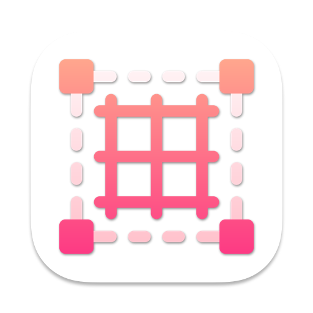
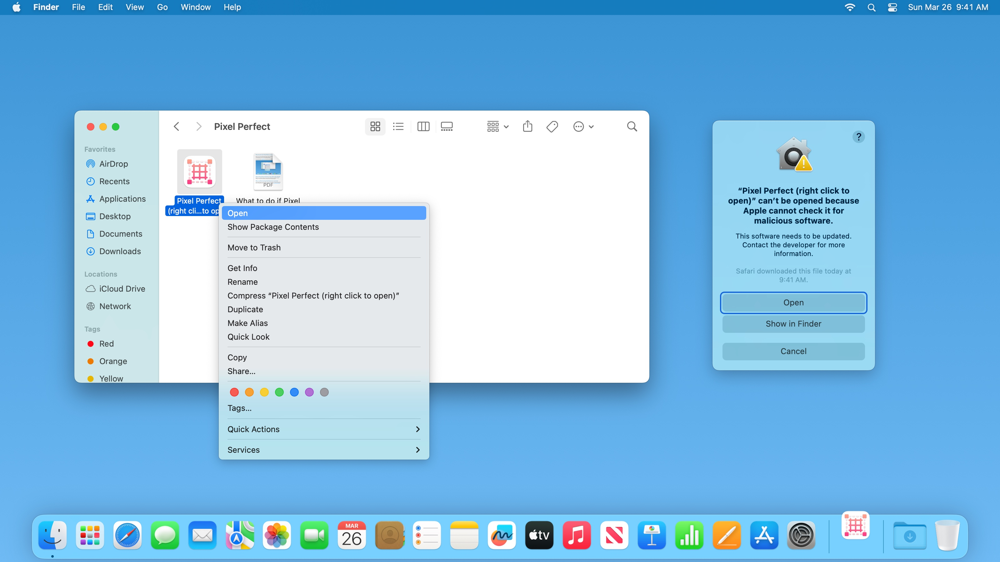
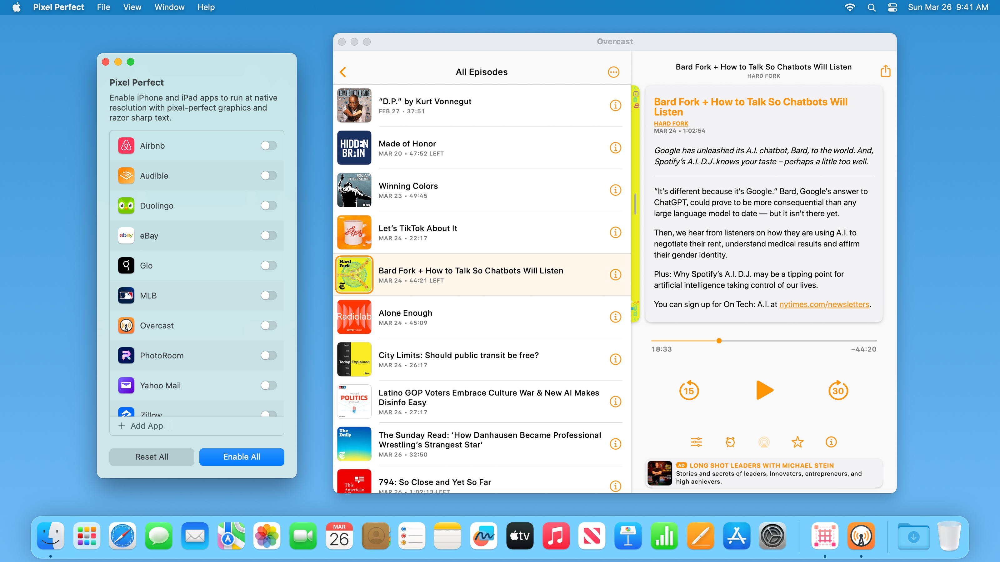
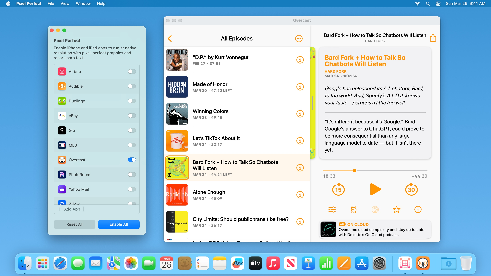
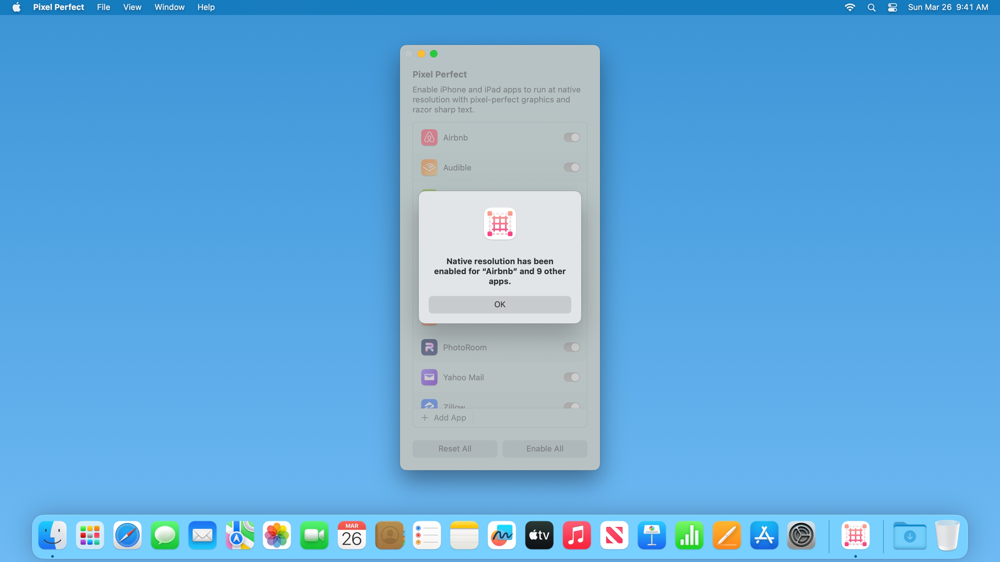
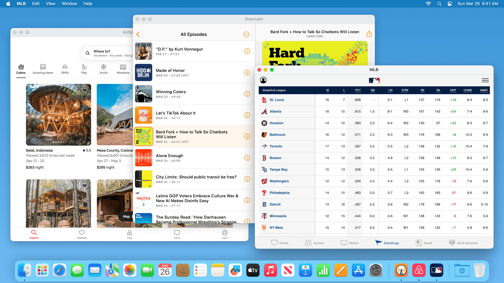

<h2>Pixel Perfect</h2>

Pixel Perfect lets you increase the text size of iPhone and iPad apps on Mac. Say goodbye to small and blurry text, and enjoy pixel-perfect graphics, all rendered at 100% native resolution. Compatible with <a href="https://apps.apple.com/app/macos-ventura/id1638787999">macOS Ventura</a>, <a href="https://apps.apple.com/app/macos-monterey/id1576738294">macOS Monterey</a>, and <a href="https://apps.apple.com/app/macos-big-sur/id1526878132">macOS Big Sur</a>.

  

  

---

### Opening Pixel Perfect

After downloading Pixel Perfect, double click to open it. macOS may prompt you “Pixel Perfect cannot be opened because it is from an unidentified developer.” This is expected. 

To open Pixel Perfect, [right-click](https://support.apple.com/HT207700) on Pixel Perfect, then click “Open” as shown below.

If you right-clicked when opening Pixel Perfect for the first time, you may need to [right-click](https://support.apple.com/HT207700) for a second time. If Pixel Perfect still can’t be opened, navigate to System Settings > Privacy & Security, then scroll down and click [“Open Anyway”](https://support.apple.com/HT202491) to open Pixel Perfect.

Pixel Perfect will not harm your Mac. This alert shows up because Pixel Perfect is not notarized. Pixel Perfect is [open source](https://github.com/cormiertyshawn895/PixelPerfect), so you can always [examine its source code](https://github.com/cormiertyshawn895/PixelPerfect/tree/master/PixelPerfect) to verify its inner working.

---

### Using Pixel Perfect

By default, iPhone and iPad apps run at 77% scaling on your Mac. In some apps, this may result in small and blurry text. To improve legibility, click the toggle to run your favorite app at native resolution.

When iPhone and iPad app run at native resolution, you will experience pixel-perfect graphics, as well as text that are larger and sharper.

You can also choose “Enable All”. This makes all currently installed iPhone and iPad apps run at native resolution.

---

### Frequently Asked Questions

#### Can I use Pixel Perfect on Mac computers with Apple silicon?

Yes, Pixel Perfect is fully compatible with Mac computers with Apple Silicon.

#### Can I use Pixel Perfect with iPhone and iPad apps downloaded from the Mac App Store?

Yes, you can use Pixel Perfect with iPhone and iPad apps downloaded from the Mac App Store. You can find  iPhone and iPad apps by looking for “Designed for iPad” and “Designed for iPhone” in Mac App Store listings.

#### Can I use Pixel Perfect with iPhone and iPad apps downloaded from PlayCover or Sideloadly?

Yes, you can also use Pixel Perfect with iPhone and iPad apps downloaded from third party sources, such as [PlayCover](https://playcover.io) and [Sideloadly](https://sideloadly.io).

#### Can I use Pixel Perfect with Mac Catalyst apps?
Pixel Perfect only shows iPhone and iPad apps by default, but you can manually add Mac Catalyst apps in Pixel Perfect. 

Keep in mind that there are two types of Mac Catalyst apps. Mac Catalyst (Scaled to Match iPad), and Mac Catalyst (Optimized for Mac). Apps built with Mac Catalyst (Optimized for Mac) already run at native resolution, so Pixel Perfect is not applicable. If you want to run a Mac Catalyst (Scaled to Match iPad) app at native resolution, click “Add App” and manually choose the app. 

Twitter is not compatible with Pixel Perfect.

#### Can I use Pixel Perfect on Intel-based Mac?

With an Intel-based Mac, you can manually add Mac Catalyst (Scaled to Match iPad) app into Pixel Perfect to run them at native resolution.

#### Can I run iPhone and iPad apps at native resolution without using Pixel Perfect?

Yes, but only for a small subset of iPhone and iPad apps. You need to use Pixel Perfect to run most iPhone and iPad apps at native resolution.

If the app listing shows “Designed for iPhone” (e.g: [Castro](https://apps.apple.com/app/id1080840241)), you can run it at native resolution without using Pixel Perfect. Open the app, click the “Window” menu, and choose “Zoom”. This also works on a small number of iPad apps that don’t support Split View, such as [Hypic](https://apps.apple.com/app/id1644042837).

---

### Troubleshooting Tips

#### Why are iPhone and iPad apps not showing up in the list?

Pixel Perfect relies on the Spotlight index on your Mac to determine which iPhone and iPad apps are installed. If Spotlight is still indexing your Mac, or you have turned off Spotlight indexing, you can click “Add App” and manually choose an iPhone or iPad app.

#### When asked by Pixel Perfect, I chose to quit and reopen the iPhone or iPad app later. Why didn’t my changes take effect after reopening the app?

Closing an iPhone or iPad app on the Mac often does not immediately quit the app. Instead, the app keeps running in the background for a short period of time. For changes to take effect immediately, you should choose “Quit & Reopen” when Pixel Perfect asks you. If you chose “Later”, you can open the Apple menu > Force Quit…, then Force Quit and reopen the iPhone or iPad app for changes to take effect immediately.

#### I already enabled native resolution for all apps, why do newly installed apps still run at scaled resolution?

When enabling native resolution for all apps, changes are only applied to apps that are installed at the moment. After you install new iPhone or iPad apps, open Pixel Perfect again to enable native resolution for newly installed apps.
